# Workflow & architecture diagrams — Banking Admin Portal

**The whole project, drawn out.** System architecture, layered structure on both sides, request lifecycle, every key user flow, the audit-recording pipeline, the validation chain, and the data model — all as renderable Mermaid diagrams plus ASCII fallbacks where they help.

GitHub, GitLab, VS Code's Markdown preview, and most modern Markdown renderers display the Mermaid blocks below natively. Open this file on GitHub for the best view.

---

## Table of contents

1. [How to read this document](#1-how-to-read-this-document)
2. [System architecture — the 10 000-ft view](#2-system-architecture--the-10-000-ft-view)
3. [Frontend layering](#3-frontend-layering)
4. [Backend layering (MVC + repository + service)](#4-backend-layering-mvc--repository--service)
5. [Request / response lifecycle (end to end)](#5-request--response-lifecycle-end-to-end)
6. [User flow workflows](#6-user-flow-workflows)
   - 6a. [Creating an employee](#6a-creating-an-employee)
   - 6b. [Toggling employee status (PATCH)](#6b-toggling-employee-status-patch)
   - 6c. [Deleting an employee with cascade soft-close](#6c-deleting-an-employee-with-cascade-soft-close)
   - 6d. [Adding an account](#6d-adding-an-account)
   - 6e. [Closing and reopening an account](#6e-closing-and-reopening-an-account)
   - 6f. [Viewing the audit log](#6f-viewing-the-audit-log)
7. [State management flow — NgRx + Signals split](#7-state-management-flow--ngrx--signals-split)
8. [Cross-cutting concerns](#8-cross-cutting-concerns)
   - 8a. [Correlation-id end-to-end](#8a-correlation-id-end-to-end)
   - 8b. [Error normalisation pipeline](#8b-error-normalisation-pipeline)
   - 8c. [Validation chain (client + server)](#8c-validation-chain-client--server)
   - 8d. [Audit recording pipeline](#8d-audit-recording-pipeline)
9. [Data model — entity relationships](#9-data-model--entity-relationships)
10. [Audit log entry shape per action](#10-audit-log-entry-shape-per-action)
11. [Dev environment orchestration](#11-dev-environment-orchestration)
12. [Testing pipeline](#12-testing-pipeline)

---

## 1. How to read this document

Three diagram kinds appear below, each chosen for what it shows best:

| Kind | When used | What it shows |
|---|---|---|
| **`graph` / `flowchart`** | Architecture, layering | Static relationships — boxes and arrows |
| **`sequenceDiagram`** | Workflows, user flows | Time-ordered interactions across processes |
| **`erDiagram` / `classDiagram`** | Data model | Entity shape + cardinality |

Each section pairs a Mermaid block (the canonical version) with one or two sentences telling you what to look at. The narrative captions are deliberately short; the diagrams are the point.

---

## 2. System architecture — the 10 000-ft view

The whole stack on one page. Two processes, one proxy, one in-memory store.

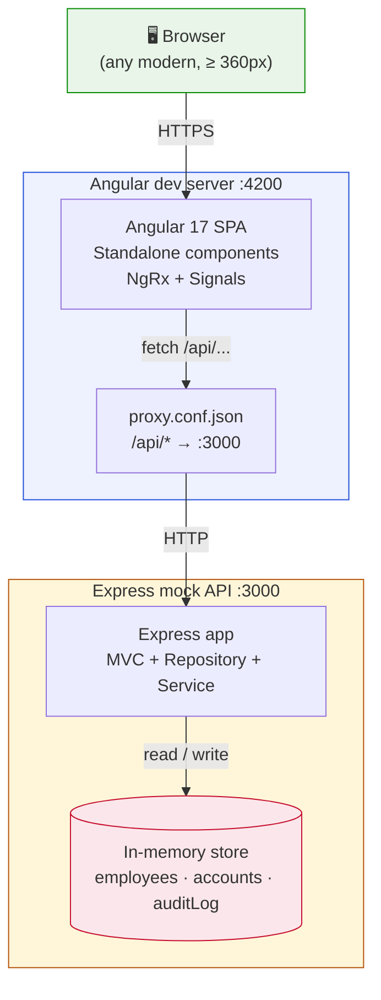

**What to notice.** Everything is local. No databases, no cloud services, no auth provider. The proxy is what avoids CORS in development — production would terminate at a reverse proxy (nginx, ALB, etc.) instead.

---

## 3. Frontend layering

Angular standalone components consume the NgRx store through per-feature facades. Signals appear at the leaf via `toSignal()`. Two HTTP interceptors sit between the services and the network.

```mermaid
graph TB
    subgraph View["View layer (templates + components)"]
        Templates["Component templates<br/>@if / @for / @let"]
        Components["Standalone components<br/>OnPush change detection<br/>signal() · computed() · effect()"]
    end

    subgraph Facade["Facade layer (interface)"]
        EmployeeFacade["EmployeeFacade<br/>(Observable surface)"]
        AccountFacade["AccountFacade"]
        AuditService["AuditApiService<br/>(simple HTTP wrapper)"]
    end

    subgraph Store["NgRx store"]
        Actions["Actions<br/>createActionGroup()"]
        Reducers["Reducers<br/>createFeature()"]
        Selectors["Selectors<br/>(memoised)"]
        Effects["Effects<br/>(functional, HTTP)"]
    end

    subgraph HTTP["HTTP layer"]
        CorrelationInterceptor["correlation-id interceptor<br/>(attach X-Correlation-Id)"]
        ErrorInterceptor["error interceptor<br/>(normalise to ApiError)"]
        ApiServices["EmployeeApiService<br/>AccountApiService"]
    end

    Components -->|read state| Facade
    Components -->|read via toSignal()| Facade
    Components -->|dispatch via facade| Facade

    EmployeeFacade --> Actions
    AccountFacade --> Actions
    EmployeeFacade -->|select| Selectors

    Actions --> Reducers
    Actions --> Effects
    Effects --> Selectors
    Effects --> ApiServices

    AuditService --> ApiServices

    ApiServices --> CorrelationInterceptor
    CorrelationInterceptor --> ErrorInterceptor
    ErrorInterceptor -.->|HTTP| Backend(("/api/* to Express"))

    Templates --- Components

    style View fill:#E8F5E8,stroke:#008A00
    style Facade fill:#EEF2FF,stroke:#1f4ed8
    style Store fill:#FFF6DA,stroke:#B45309
    style HTTP fill:#FBE7EB,stroke:#C7102E
```

**What to notice.** Components never import from `Store` directly — they go through a facade. The facade still exposes Observables (`items$`, `loading$`); components decide whether to consume them as observables or bridge them to signals via `toSignal()`. The audit log is a special case — it bypasses NgRx entirely because it's read-only and only displayed in one place.

---

## 4. Backend layering (MVC + repository + service)

Each layer has exactly one job. The arrow direction is the *call* direction — nothing ever calls upward.

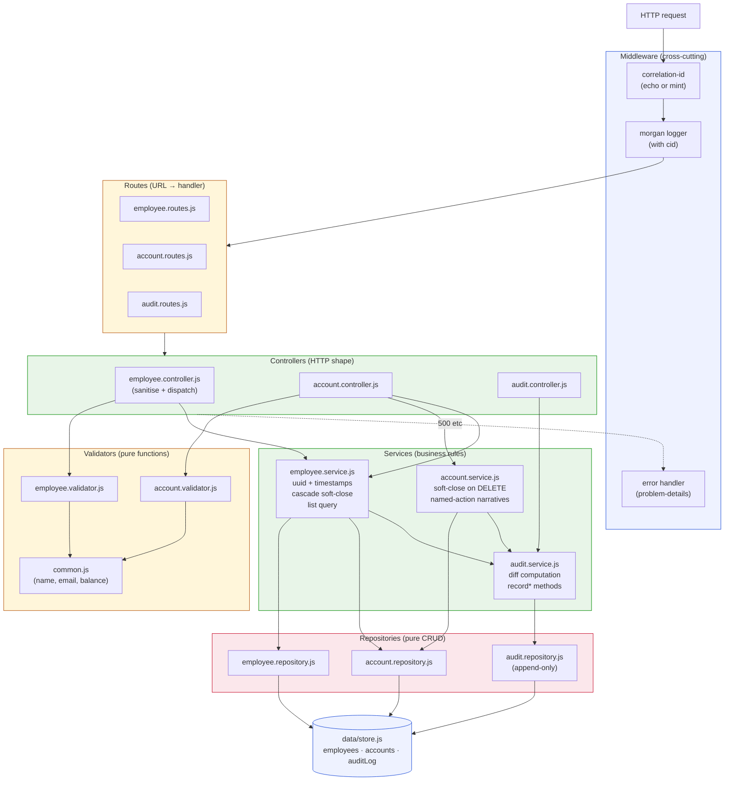

**The unbreakable rule.** A controller importing a repository, or a service touching `data/store.js` directly, is the architectural smell. None of them do.

---

## 5. Request / response lifecycle (end to end)

A single `POST /api/employees` request, traced through every box that touches it. Same pattern applies to PUT, PATCH, DELETE — only the verb and the service method change.

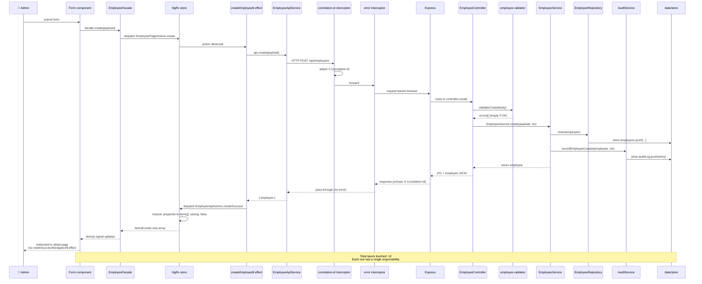

**What this proves.** The single source of truth is the store. The view never holds a copy of the employee — it reads through the facade, which reads the store. If we swap the in-memory store for Postgres tomorrow, the only file that changes is the repository.

---

## 6. User flow workflows

Each subsection shows the **happy path** for one user action. Failure paths (validation rejection, 404, 409 conflict) are similar but exit at the validator or service layer.

### 6a. Creating an employee

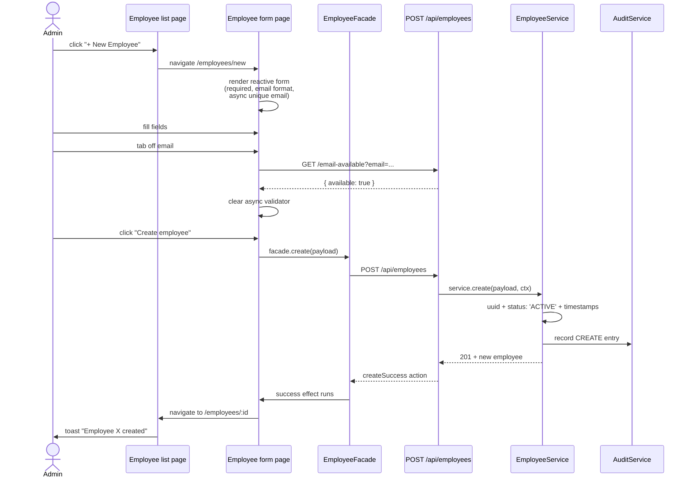

### 6b. Toggling employee status (PATCH)

The "Mark INACTIVE" / "Mark ACTIVE" button on the detail page issues a partial update — just the `status` field.

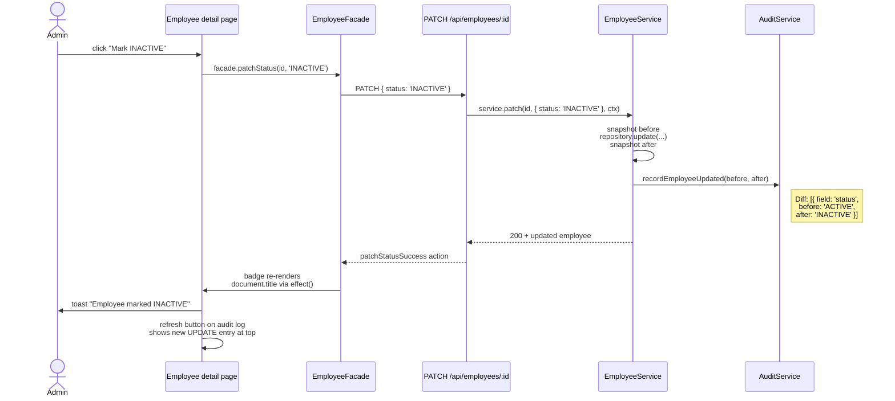

### 6c. Deleting an employee with cascade soft-close

The most complex single action in the system. One DELETE produces multiple audit entries.

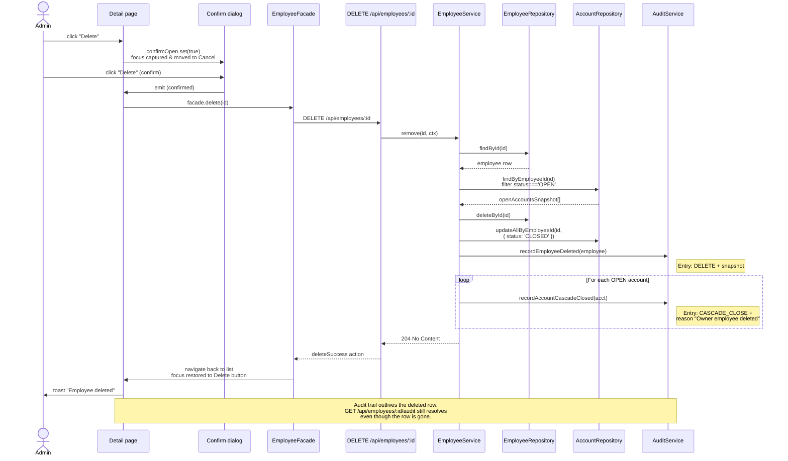

### 6d. Adding an account

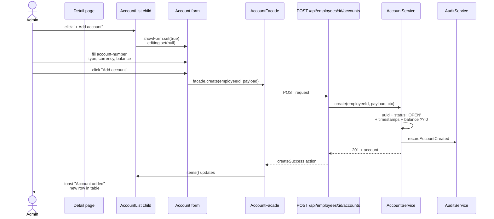

### 6e. Closing and reopening an account

The status-flip flow demonstrates a non-trivial audit-narrative decision: a CLOSE through the named endpoint produces a `CLOSE` audit action, but the same status change via a generic PATCH produces a `UPDATE` with a diff. The service layer makes the call.

```mermaid
flowchart TB
    Start([User clicks "Close" on a row])
    Confirm{Confirm dialog<br/>shows}
    Cancel([User clicks Cancel<br/>→ noop])
    Submit[User clicks "Close account"]
    PatchOrDelete[/DELETE /api/accounts/:id/]
    Service[AccountService.close]
    UpdateRepo[Repository sets<br/>status: CLOSED]
    AuditClose[AuditService<br/>recordAccountClosed<br/>action: 'CLOSE']
    Done[Toast "Account closed"<br/>Row shows CLOSED badge<br/>Edit/Close → Reopen]

    Reopen([User clicks "Reopen"<br/>on a CLOSED row])
    Patch[/PATCH /api/accounts/:id<br/>body: status: OPEN/]
    PatchSvc[AccountService.patch]
    StatusOnly{Is patch only<br/>a status flip<br/>to OPEN?}
    AuditReopen[AuditService<br/>recordAccountReopened<br/>action: 'REOPEN']
    AuditUpdate[AuditService<br/>recordAccountUpdated<br/>action: 'UPDATE']
    DoneReopen[Toast "Account updated"<br/>Row shows OPEN badge]

    Start --> Confirm
    Confirm -->|cancel| Cancel
    Confirm -->|confirm| Submit
    Submit --> PatchOrDelete
    PatchOrDelete --> Service
    Service --> UpdateRepo
    Service --> AuditClose
    AuditClose --> Done

    Reopen --> Patch
    Patch --> PatchSvc
    PatchSvc --> StatusOnly
    StatusOnly -->|yes| AuditReopen
    StatusOnly -->|no| AuditUpdate
    AuditReopen --> DoneReopen
    AuditUpdate --> DoneReopen

    style AuditClose fill:#EEF2FF,stroke:#1f4ed8
    style AuditReopen fill:#E8F5E8,stroke:#008A00
    style AuditUpdate fill:#FFF6DA,stroke:#B45309
```

**The interesting branch.** `AccountService.patch()` checks whether the incoming patch is *only* a status change, and chooses the audit narrative accordingly. Multi-field PATCHes always produce `UPDATE`, never `CLOSE`/`REOPEN`. This decision lives in the service so the repository stays a dumb append target.

### 6f. Viewing the audit log

The only feature in the app that **doesn't** use NgRx — read-only, single-view, no global state worth managing.

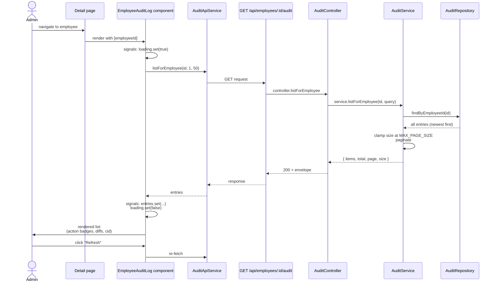

**Why no NgRx here.** The audit log is read-only, viewed in one place, never cross-referenced. A full NgRx slice for one GET endpoint would be five files of boilerplate. Signals + a simple HTTP service is the right level of ceremony.

---

## 7. State management flow — NgRx + Signals split

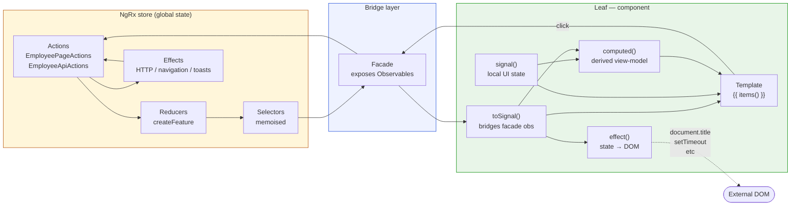

**The boundary.** NgRx owns global state. The facade is the public surface. Signals live only inside the component layer. The arrow direction matters: components dispatch *into* the store via the facade; data flows *out* of the store back via signals.

---

## 8. Cross-cutting concerns

Four pipelines that touch many features. Each is shown as a focused flow so it's easy to reason about in isolation.

### 8a. Correlation-id end-to-end

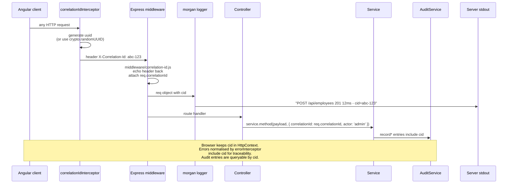

### 8b. Error normalisation pipeline

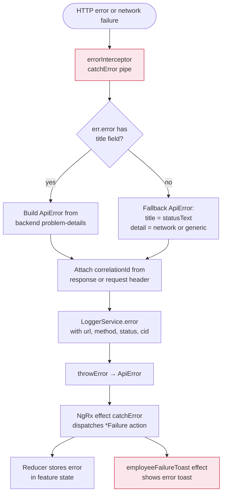

### 8c. Validation chain (client + server)

Validation runs **twice** by design — the client validates for UX, the server validates because the client can be bypassed.

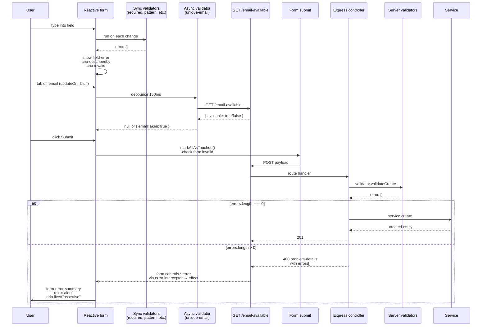

### 8d. Audit recording pipeline

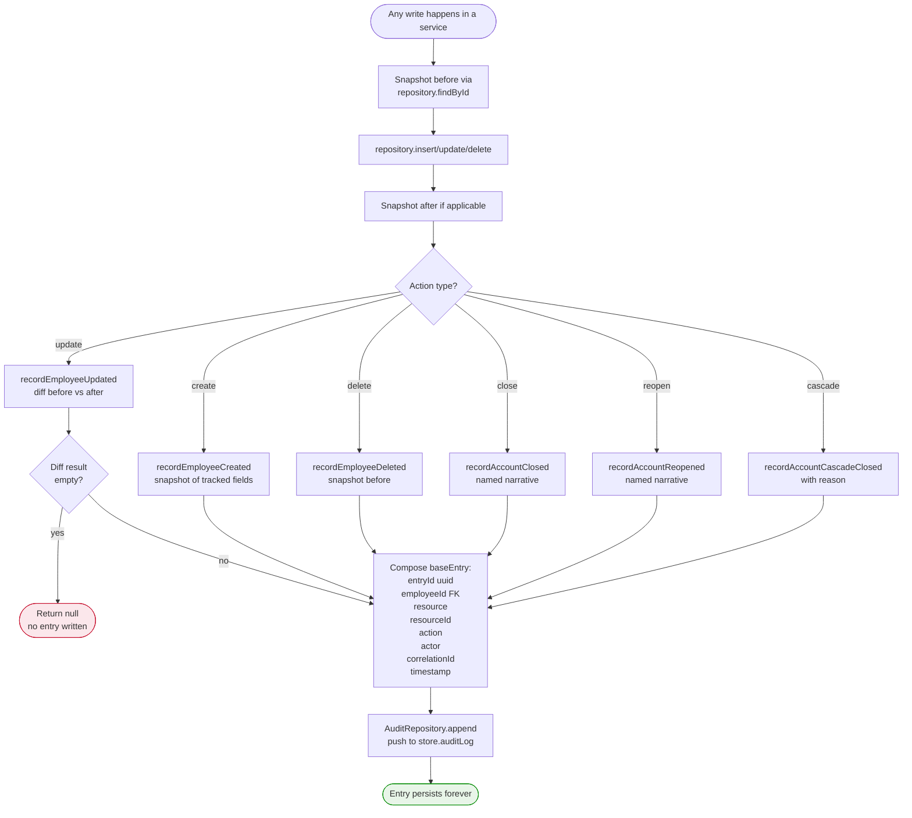

**The rule.** No-op UPDATEs don't pollute the trail. Every other action always produces an entry. This rule lives in the service (specifically `AuditService.recordEmployeeUpdated` / `recordAccountUpdated`), not the controller, so any path that calls the service inherits it.

---

## 9. Data model — entity relationships

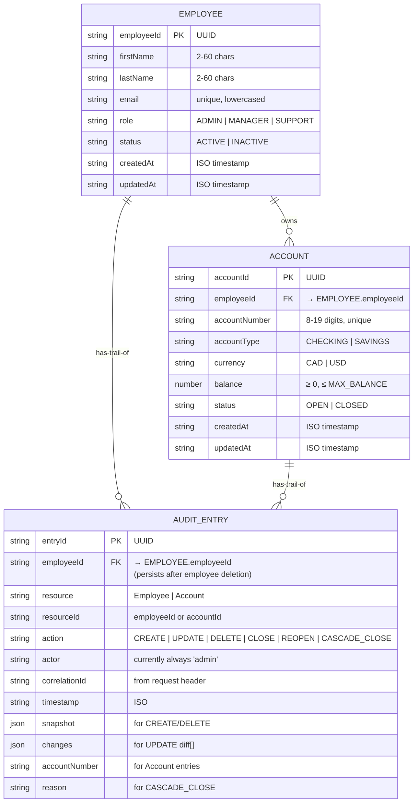

**Key constraint not visible above.** `AUDIT_ENTRY.employeeId` is an FK *in spirit only*. When an employee is hard-deleted, the audit entries persist by design — the trail outlives the row. The FK column means "this entry belongs to the audit trail named by this employee id", not "this entry has a live FK target".

---

## 10. Audit log entry shape per action

The audit entry is a discriminated record. Which optional fields are present depends on `action`. Visual reference:

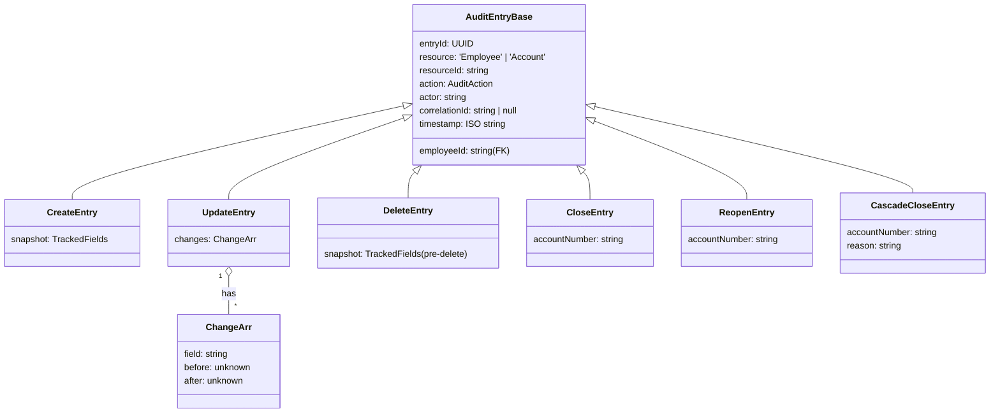

The renderer (`EmployeeAuditLogComponent`) pattern-matches on `action` and picks the right detail shape.

---

## 11. Dev environment orchestration

What actually happens when you run `npm start` from the project root.

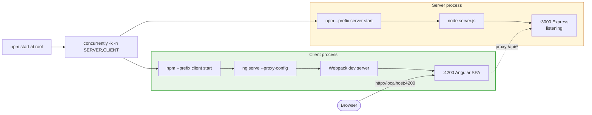

**The flag `-k` is what makes this safe.** When either process dies, `concurrently` kills the other. No half-running stacks if you Ctrl+C the terminal.

---

## 12. Testing pipeline

What runs where, and what each test layer is responsible for.

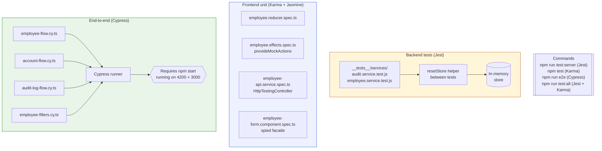

**Coverage rules.** Backend Jest tests target the two highest-risk services (the audit-diff computation and the cascade-close logic). Frontend Karma tests target the canonical NgRx layers (reducer, effect, service, form). Cypress catches integration bugs across both stacks.

---

## One paragraph to internalise

> Every diagram above describes a real piece of this codebase you can open and point at. The system architecture matches `app.js` + `app.config.ts`; the layered backend matches the folder layout under `server/`; the request lifecycle matches what you see in the Network tab when you click a button. None of this is aspirational — it's all in the repo. Drawing it on a whiteboard during the interview is a 60-second exercise *because* I drew it here first.

---

*Banking Admin Portal — architecture & workflow reference.*